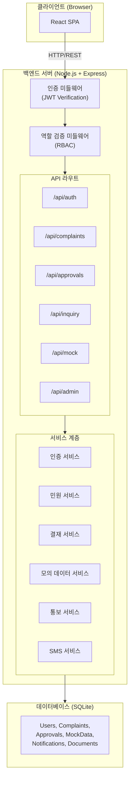
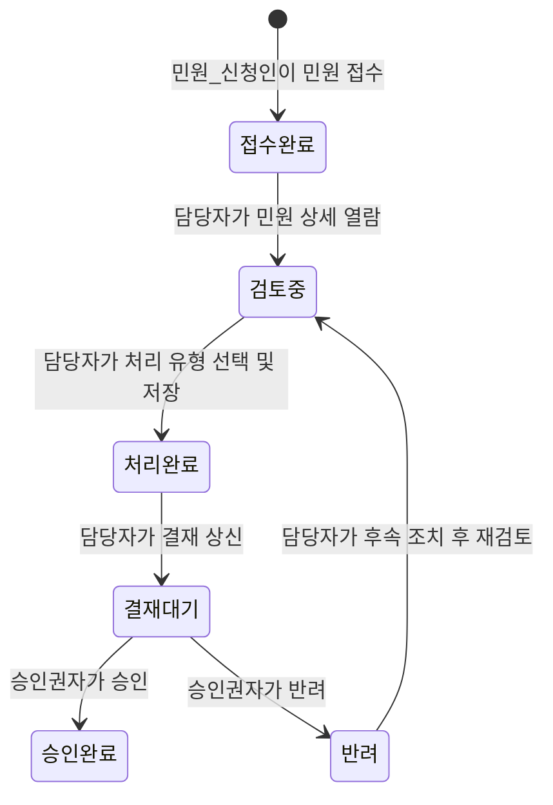
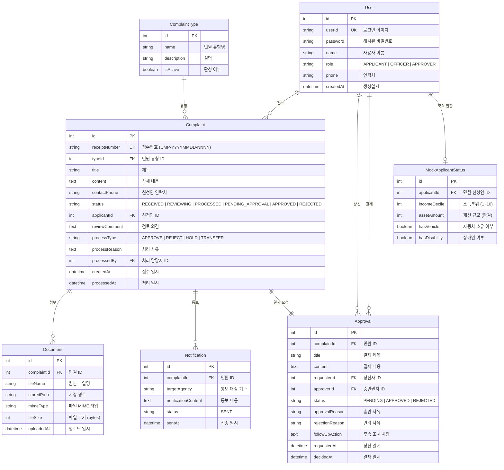

# 기술 설계 문서 (Technical Design Document)

## 개요 (Overview)

본 문서는 공공기관 민원 처리 시연용 웹 애플리케이션의 기술 설계를 정의합니다. 이 시스템은 민원 접수부터 결재 승인까지의 전체 민원 처리 흐름을 시연할 수 있도록 구성되며, 대한민국 정부24 플러스(plus.gov.kr)의 Look & Feel을 참고합니다.

### 기술 스택 (Technology Stack)

| 구분 | 기술 | 선택 사유 |
|------|------|-----------|
| 프론트엔드(Frontend) | React 18 + TypeScript | 컴포넌트(component) 기반 UI 구성, 타입 안전성 |
| 상태 관리(State Management) | Zustand | 경량 상태 관리, 보일러플레이트(boilerplate) 최소화 |
| UI 프레임워크(UI Framework) | Ant Design | 정부24 스타일과 유사한 관공서 스타일 컴포넌트 제공 |
| 라우팅(Routing) | React Router v6 | 역할 기반 라우팅, 중첩 레이아웃 지원 |
| 백엔드(Backend) | Node.js + Express | 빠른 API 개발, 시연용으로 적합 |
| ORM | Prisma | 타입 안전한 DB 접근, 마이그레이션(migration) 관리 |
| 데이터베이스(Database) | SQLite | 별도 DB 서버 불필요, 시연용으로 적합 |
| 인증(Authentication) | JWT (JSON Web Token) | 무상태(stateless) 인증, 역할 기반 접근 제어 |
| 파일 업로드(File Upload) | Multer | Express 기반 파일 업로드 미들웨어(middleware) |
| 테스트(Testing) | Vitest + fast-check | 단위 테스트 및 속성 기반 테스트(property-based testing) |
| 빌드 도구(Build Tool) | Vite | 빠른 개발 서버, HMR 지원 |

### 설계 원칙 (Design Principles)

- **시연 중심 설계**: 실제 외부 시스템 연동 없이 모의(mock) 데이터로 전체 흐름 시연 가능
- **역할 기반 접근 제어(RBAC)**: 민원_신청인, 담당자, 승인권자 3개 역할에 따른 화면 및 기능 분리
- **단순한 배포**: SQLite 사용으로 별도 DB 서버 없이 단일 프로세스로 실행
- **관리 용이성**: 시연용 데이터를 별도 관리 화면에서 CRUD 가능

## 아키텍처 (Architecture)

### 시스템 아키텍처 다이어그램 (System Architecture Diagram)



### 민원 처리 흐름 다이어그램 (Complaint Processing Flow)



### 프로젝트 구조 (Project Structure)

```
civil-complaint-app/
├── client/                          # 프론트엔드
│   ├── src/
│   │   ├── components/              # 공통 컴포넌트
│   │   │   ├── Layout.tsx           # 헤더, 사이드바, 푸터 레이아웃
│   │   │   ├── ProtectedRoute.tsx   # 역할 기반 라우트 가드
│   │   │   └── StatusBadge.tsx      # 민원 상태 뱃지
│   │   ├── pages/                   # 페이지 컴포넌트
│   │   │   ├── LoginPage.tsx
│   │   │   ├── applicant/           # 민원_신청인 페이지
│   │   │   ├── officer/             # 담당자 페이지
│   │   │   ├── approver/            # 승인권자 페이지
│   │   │   ├── inquiry/             # 민원 조회 페이지
│   │   │   └── admin/               # 시연 데이터 관리 페이지
│   │   ├── stores/                  # Zustand 상태 저장소
│   │   ├── services/                # API 호출 함수
│   │   ├── types/                   # TypeScript 타입 정의
│   │   └── App.tsx
│   └── package.json
├── server/                          # 백엔드
│   ├── src/
│   │   ├── routes/                  # API 라우트
│   │   ├── services/                # 비즈니스 로직
│   │   ├── middleware/              # 인증, 역할 검증
│   │   ├── prisma/                  # Prisma 스키마 및 마이그레이션
│   │   └── app.ts
│   └── package.json
└── package.json                     # 루트 (monorepo 스크립트)
```


## 컴포넌트 및 인터페이스 (Components and Interfaces)

### 백엔드 API 인터페이스 (Backend API Interfaces)

#### 1. 인증 API (Authentication API)

```typescript
// POST /api/auth/login
// 요청(Request)
interface LoginRequest {
  userId: string;    // 사용자 아이디
  password: string;  // 비밀번호
}

// 응답(Response)
interface LoginResponse {
  token: string;           // JWT 토큰
  user: {
    id: number;
    userId: string;
    name: string;
    role: 'APPLICANT' | 'OFFICER' | 'APPROVER';  // 역할
  };
}
```

#### 2. 민원 API (Complaint API)

```typescript
// POST /api/complaints - 민원 접수
interface CreateComplaintRequest {
  type: string;           // 민원 유형
  title: string;          // 제목
  content: string;        // 상세 내용
  contactPhone: string;   // 연락처
  documents?: File[];     // 증빙 서류 (multipart/form-data)
}

interface ComplaintResponse {
  id: number;
  receiptNumber: string;  // 접수번호 (예: "CMP-20250101-0001")
  type: string;
  title: string;
  content: string;
  status: ComplaintStatus;
  applicantId: number;
  contactPhone: string;
  createdAt: string;      // 접수 일시
  documents: DocumentInfo[];
}

type ComplaintStatus = 'RECEIVED' | 'REVIEWING' | 'PROCESSED' | 'PENDING_APPROVAL' | 'APPROVED' | 'REJECTED';

// GET /api/complaints - 민원 목록 조회
interface ComplaintListQuery {
  status?: ComplaintStatus;  // 상태 필터
  page?: number;             // 페이지 번호
  limit?: number;            // 페이지 크기
}

interface ComplaintListResponse {
  items: ComplaintResponse[];
  total: number;
  page: number;
  limit: number;
}

// GET /api/complaints/:id - 민원 상세 조회
// PUT /api/complaints/:id/review - 검토 의견 저장
interface ReviewRequest {
  reviewComment: string;  // 검토 의견
}

// PUT /api/complaints/:id/process - 민원 처리
interface ProcessComplaintRequest {
  processType: 'APPROVE' | 'REJECT' | 'HOLD' | 'TRANSFER';  // 처리 유형
  processReason: string;  // 처리 사유
}
```

#### 3. 타 기관 통보 API (External Notification API)

```typescript
// POST /api/complaints/:id/notifications - 타 기관 통보
interface CreateNotificationRequest {
  targetAgency: string;       // 통보 대상 기관
  notificationContent: string; // 통보 내용
}

interface NotificationResponse {
  id: number;
  complaintId: number;
  targetAgency: string;
  notificationContent: string;
  sentAt: string;
  status: 'SENT';  // 시연용: 항상 성공
}
```

#### 4. 결재 API (Approval API)

```typescript
// POST /api/approvals - 결재 상신
interface CreateApprovalRequest {
  complaintId: number;
  title: string;          // 결재 제목
  content: string;        // 결재 내용
  approverId: number;     // 승인권자 ID
}

// GET /api/approvals - 결재 목록 조회 (승인권자용)
interface ApprovalListResponse {
  items: ApprovalResponse[];
  total: number;
  page: number;
  limit: number;
}

interface ApprovalResponse {
  id: number;
  complaintId: number;
  title: string;
  content: string;
  requesterId: number;
  requesterName: string;
  approverId: number;
  status: 'PENDING' | 'APPROVED' | 'REJECTED';
  requestedAt: string;
  decidedAt?: string;
  approvalReason?: string;    // 승인 사유
  rejectionReason?: string;   // 반려 사유
  followUpAction?: string;    // 후속 조치 사항
  complaint: ComplaintResponse;
  reviewComment?: string;
  notifications: NotificationResponse[];
}

// PUT /api/approvals/:id/approve - 승인
interface ApproveRequest {
  reason: string;  // 승인 사유 (필수)
}

// PUT /api/approvals/:id/reject - 반려
interface RejectRequest {
  reason: string;         // 반려 사유 (필수)
  followUpAction: string; // 후속 조치 사항 (필수)
}
```

#### 5. 민원 조회 API (Inquiry API)

```typescript
// POST /api/inquiry/verify - SMS 본인 확인 요청
interface SmsVerifyRequest {
  receiptNumber: string;  // 민원 접수번호
}

interface SmsVerifyResponse {
  verificationId: string;  // 인증 세션 ID
  message: string;         // "인증 코드가 발송되었습니다"
}

// POST /api/inquiry/confirm - SMS 인증 코드 확인
interface SmsConfirmRequest {
  verificationId: string;
  code: string;            // 인증 코드 (시연용: 항상 "123456")
}

interface SmsConfirmResponse {
  success: boolean;
  complaint?: ComplaintResponse;  // 성공 시 민원 상세 정보
  message?: string;               // 실패 시 오류 메시지
}
```

#### 6. 시연 데이터 관리 API (Admin API)

```typescript
// GET /api/admin/mock-data - 모의 데이터 목록 조회
// POST /api/admin/mock-data - 모의 데이터 등록
// PUT /api/admin/mock-data/:id - 모의 데이터 수정
// DELETE /api/admin/mock-data/:id - 모의 데이터 삭제

interface MockApplicantStatus {
  id: number;
  applicantId: number;
  incomeDecile: number;       // 소득분위 (1~10)
  assetAmount: number;        // 재산 규모 (만원)
  hasVehicle: boolean;        // 자동차 소유 여부
  hasDisability: boolean;     // 장애인 여부
}

// GET /api/admin/users - 사용자 목록 조회
// POST /api/admin/users - 사용자 등록
// PUT /api/admin/users/:id - 사용자 수정
// DELETE /api/admin/users/:id - 사용자 삭제

// GET /api/admin/complaint-types - 민원 유형 목록 조회
// POST /api/admin/complaint-types - 민원 유형 등록
// PUT /api/admin/complaint-types/:id - 민원 유형 수정
// DELETE /api/admin/complaint-types/:id - 민원 유형 삭제
```

### 프론트엔드 주요 컴포넌트 (Frontend Key Components)

#### 레이아웃 컴포넌트 (Layout Component)

```typescript
// 정부24 스타일 레이아웃
interface LayoutProps {
  children: React.ReactNode;
}

// Layout 구성:
// - Header: 기관명 로고, 네비게이션 메뉴, 사용자 정보, 로그아웃
// - Sidebar: 역할별 메뉴 (민원_신청인/담당자/승인권자 각각 다른 메뉴)
// - Content: 메인 콘텐츠 영역
// - Footer: 기관 정보, 저작권 표시
```

#### 역할별 페이지 구성 (Role-based Page Structure)

| 역할 | 페이지 | 설명 |
|------|--------|------|
| 민원_신청인 | 대시보드 | 본인 민원 목록, 접수 현황 |
| 민원_신청인 | 민원 접수 | 민원 양식 작성, 증빙 서류 첨부 |
| 민원_신청인 | 민원 상세 | 본인 민원 진행 상황 확인 |
| 담당자 | 대시보드 | 전체 민원 목록, 상태별 필터 |
| 담당자 | 민원 상세/검토 | 민원 내용 확인, 민원인 현황 조회, 검토 의견 작성 |
| 담당자 | 민원 처리 | 처리 유형 선택, 타 기관 통보 |
| 담당자 | 결재 상신 | 결재 양식 작성, 상신 |
| 승인권자 | 대시보드 | 결재 대기 목록 |
| 승인권자 | 결재 상세 | 결재 내용 검토, 승인/반려 |
| 공통 | 로그인 | 사용자 인증 |
| 공통 | 민원 조회 | 접수번호 + SMS 본인 확인 후 조회 |
| 관리자 | 데이터 관리 | 시연용 데이터 CRUD |

### 미들웨어 (Middleware)

```typescript
// 인증 미들웨어 - JWT 토큰 검증
function authMiddleware(req: Request, res: Response, next: NextFunction): void;

// 역할 검증 미들웨어 - 특정 역할만 접근 허용
function roleMiddleware(...roles: UserRole[]): RequestHandler;
```


## 데이터 모델 (Data Models)

### ER 다이어그램 (Entity Relationship Diagram)



### Prisma 스키마 (Prisma Schema)

```prisma
datasource db {
  provider = "sqlite"
  url      = "file:./dev.db"
}

generator client {
  provider = "prisma-client-js"
}

enum UserRole {
  APPLICANT
  OFFICER
  APPROVER
}

enum ComplaintStatus {
  RECEIVED
  REVIEWING
  PROCESSED
  PENDING_APPROVAL
  APPROVED
  REJECTED
}

enum ProcessType {
  APPROVE
  REJECT
  HOLD
  TRANSFER
}

enum ApprovalStatus {
  PENDING
  APPROVED
  REJECTED
}

model User {
  id        Int      @id @default(autoincrement())
  userId    String   @unique
  password  String
  name      String
  role      UserRole
  phone     String   @default("")
  createdAt DateTime @default(now())

  complaints       Complaint[]  @relation("ApplicantComplaints")
  processedComplaints Complaint[] @relation("ProcessedByOfficer")
  requestedApprovals Approval[]  @relation("RequesterApprovals")
  decidedApprovals   Approval[]  @relation("ApproverApprovals")
  mockStatus       MockApplicantStatus?
}

model ComplaintType {
  id          Int      @id @default(autoincrement())
  name        String
  description String   @default("")
  isActive    Boolean  @default(true)
  complaints  Complaint[]
}

model Complaint {
  id            Int             @id @default(autoincrement())
  receiptNumber String          @unique
  typeId        Int
  title         String
  content       String
  contactPhone  String
  status        ComplaintStatus @default(RECEIVED)
  applicantId   Int
  reviewComment String?
  processType   ProcessType?
  processReason String?
  processedById Int?
  createdAt     DateTime        @default(now())
  processedAt   DateTime?

  type          ComplaintType   @relation(fields: [typeId], references: [id])
  applicant     User            @relation("ApplicantComplaints", fields: [applicantId], references: [id])
  processedBy   User?           @relation("ProcessedByOfficer", fields: [processedById], references: [id])
  documents     Document[]
  notifications Notification[]
  approval      Approval?
}

model Document {
  id          Int      @id @default(autoincrement())
  complaintId Int
  fileName    String
  storedPath  String
  mimeType    String
  fileSize    Int
  uploadedAt  DateTime @default(now())

  complaint   Complaint @relation(fields: [complaintId], references: [id])
}

model Notification {
  id                  Int      @id @default(autoincrement())
  complaintId         Int
  targetAgency        String
  notificationContent String
  status              String   @default("SENT")
  sentAt              DateTime @default(now())

  complaint           Complaint @relation(fields: [complaintId], references: [id])
}

model Approval {
  id              Int            @id @default(autoincrement())
  complaintId     Int            @unique
  title           String
  content         String
  requesterId     Int
  approverId      Int
  status          ApprovalStatus @default(PENDING)
  approvalReason  String?
  rejectionReason String?
  followUpAction  String?
  requestedAt     DateTime       @default(now())
  decidedAt       DateTime?

  complaint       Complaint      @relation(fields: [complaintId], references: [id])
  requester       User           @relation("RequesterApprovals", fields: [requesterId], references: [id])
  approver        User           @relation("ApproverApprovals", fields: [approverId], references: [id])
}

model MockApplicantStatus {
  id            Int     @id @default(autoincrement())
  applicantId   Int     @unique
  incomeDecile  Int     // 1~10
  assetAmount   Int     // 만원 단위
  hasVehicle    Boolean @default(false)
  hasDisability Boolean @default(false)

  applicant     User    @relation(fields: [applicantId], references: [id])
}
```

### 접수번호 생성 규칙 (Receipt Number Generation)

접수번호는 `CMP-YYYYMMDD-NNNN` 형식으로 생성됩니다:
- `CMP`: 민원(Complaint) 접두사
- `YYYYMMDD`: 접수 날짜
- `NNNN`: 해당 날짜의 순번 (0001부터 시작, 4자리 제로패딩)

```typescript
// 접수번호 생성 함수
function generateReceiptNumber(date: Date, dailySequence: number): string {
  const dateStr = format(date, 'yyyyMMdd');
  const seqStr = String(dailySequence).padStart(4, '0');
  return `CMP-${dateStr}-${seqStr}`;
}
```

### 민원 상태 전이 규칙 (Status Transition Rules)

| 현재 상태 | 허용되는 다음 상태 | 트리거(Trigger) |
|-----------|-------------------|-----------------|
| RECEIVED | REVIEWING | 담당자가 민원 상세 열람 |
| REVIEWING | PROCESSED | 담당자가 처리 유형 선택 및 저장 |
| PROCESSED | PENDING_APPROVAL | 담당자가 결재 상신 |
| PENDING_APPROVAL | APPROVED | 승인권자가 승인 |
| PENDING_APPROVAL | REJECTED | 승인권자가 반려 |
| REJECTED | REVIEWING | 담당자가 후속 조치 후 재검토 |


## 정확성 속성 (Correctness Properties)

*속성(property)이란 시스템의 모든 유효한 실행에서 참이어야 하는 특성 또는 동작입니다. 속성은 사람이 읽을 수 있는 명세와 기계가 검증할 수 있는 정확성 보장 사이의 다리 역할을 합니다.*

### 속성 1: 역할 기반 인증 (Role-based Authentication)

*임의의* 사전 등록된 사용자와 올바른 인증 정보에 대해, 로그인 시 반환되는 토큰(token)에 포함된 역할(role)이 해당 사용자의 등록된 역할(APPLICANT, OFFICER, APPROVER)과 일치해야 한다.

**검증 대상: 요구사항 1.1, 1.2, 1.3**

### 속성 2: 잘못된 인증 정보 거부 (Invalid Credentials Rejection)

*임의의* 존재하지 않는 아이디 또는 틀린 비밀번호 조합에 대해, 로그인 시도는 항상 실패하고 토큰이 발급되지 않아야 한다.

**검증 대상: 요구사항 1.4**

### 속성 3: 민원 접수 상태 및 일시 기록 (Complaint Submission State and Timestamp)

*임의의* 유효한 민원 데이터(민원 유형, 제목, 상세 내용, 연락처가 모두 존재)에 대해, 민원을 제출하면 상태가 RECEIVED이고 접수 일시(createdAt)가 기록된 민원이 생성되어야 한다.

**검증 대상: 요구사항 2.2, 2.6**

### 속성 4: 접수번호 고유성 (Receipt Number Uniqueness)

*임의의* 두 개 이상의 민원을 접수했을 때, 각 민원의 접수번호(receiptNumber)는 서로 중복되지 않아야 한다.

**검증 대상: 요구사항 2.3**

### 속성 5: 필수 항목 누락 시 민원 접수 거부 (Required Fields Validation)

*임의의* 필수 입력 항목(민원 유형, 제목, 상세 내용, 연락처) 중 하나 이상이 누락되거나 빈 문자열인 민원 데이터에 대해, 제출 시도는 항상 거부되고 민원이 생성되지 않아야 한다.

**검증 대상: 요구사항 2.5**

### 속성 6: 상태별 필터링 정확성 (Status Filter Accuracy)

*임의의* 민원 상태 값으로 민원 목록을 필터링했을 때, 반환된 모든 민원의 상태는 필터 조건과 일치해야 한다.

**검증 대상: 요구사항 3.3**

### 속성 7: 민원_신청인 접근 제어 (Applicant Access Control)

*임의의* 민원_신청인이 민원 목록을 조회하거나 민원 상세를 조회할 때, 반환되는 모든 민원의 applicantId는 해당 민원_신청인의 사용자 ID와 일치해야 한다.

**검증 대상: 요구사항 3.4, 8.5, 8.9**

### 속성 8: 민원 상세 조회 필수 필드 포함 (Complaint Detail Required Fields)

*임의의* 민원에 대해 상세 조회 API를 호출했을 때, 응답에는 민원 유형, 제목, 상세 내용, 신청인 정보, 접수일시 필드가 모두 포함되어야 한다.

**검증 대상: 요구사항 4.1**

### 속성 9: 민원인 현황 조회 데이터 유효성 (Applicant Status Data Validity)

*임의의* 민원인에 대해 현황 조회 API를 호출했을 때, 응답에는 소득분위(1~10 범위), 재산 규모(0 이상 정수), 자동차 소유 여부(boolean), 장애인 여부(boolean) 필드가 모두 포함되고 각 값이 유효한 범위 내에 있어야 한다.

**검증 대상: 요구사항 4.3, 4.5**

### 속성 10: 모의 데이터 라운드 트립 (Mock Data Round Trip)

*임의의* 유효한 모의 민원인 현황 데이터를 데이터베이스에 저장한 후 조회하면, 저장한 데이터와 동일한 값이 반환되어야 한다.

**검증 대상: 요구사항 4.6, 10.3, 10.7**

### 속성 11: 검토 의견 라운드 트립 (Review Comment Round Trip)

*임의의* 검토 의견 텍스트를 민원에 저장한 후 해당 민원을 조회하면, 저장한 검토 의견과 동일한 텍스트가 반환되어야 한다.

**검증 대상: 요구사항 4.7**

### 속성 12: 민원 상태 전이 규칙 (Complaint Status Transition Rules)

*임의의* 민원에 대해, 허용되지 않는 상태 전이(예: RECEIVED에서 APPROVED로 직접 전이)를 시도하면 항상 거부되어야 하며, 허용된 상태 전이만 성공해야 한다.

**검증 대상: 요구사항 4.8, 5.6, 6.3**

### 속성 13: 타 기관 통보 이력 저장 (Notification History Persistence)

*임의의* 통보 대상 기관과 통보 내용으로 타 기관 통보를 전송한 후, 해당 민원의 통보 이력을 조회하면 전송한 내용과 동일한 데이터가 반환되어야 한다.

**검증 대상: 요구사항 5.4**

### 속성 14: 모의 통보 항상 성공 (Mock Notification Always Succeeds)

*임의의* 통보 요청에 대해, 모의 전송은 항상 성공(status: SENT) 응답을 반환해야 한다.

**검증 대상: 요구사항 5.5, 10.4**

### 속성 15: 결재 상신 필수 항목 검증 (Approval Request Required Fields Validation)

*임의의* 결재 상신 데이터에서 결재 제목, 결재 내용, 승인권자 중 하나 이상이 누락되면, 상신 시도는 항상 거부되어야 한다.

**검증 대상: 요구사항 6.4**

### 속성 16: 결재 문서 자동 포함 (Approval Document Auto-inclusion)

*임의의* 처리 완료된 민원에 대해 결재를 상신하면, 결재 상세 조회 시 민원 처리 내역, 검토 의견, 타 기관 통보 이력이 모두 포함되어야 한다.

**검증 대상: 요구사항 6.5, 7.2**

### 속성 17: 결재 결정 상태 변경 및 사유 저장 (Approval Decision State Change and Reason Persistence)

*임의의* PENDING 상태 결재에 대해, 승인 시 민원 상태가 APPROVED로 변경되고 승인 사유가 저장되어야 하며, 반려 시 민원 상태가 REJECTED로 변경되고 반려 사유와 후속 조치 사항이 저장되어야 한다.

**검증 대상: 요구사항 7.4, 7.6**

### 속성 18: 결재 사유 필수 입력 (Approval Reason Required)

*임의의* 결재에 대해, 승인 사유 없이 승인을 시도하거나 반려 사유 또는 후속 조치 사항 없이 반려를 시도하면 항상 거부되어야 한다.

**검증 대상: 요구사항 7.8**

### 속성 19: 반려 민원 후속 조치 표시 (Rejected Complaint Follow-up Display)

*임의의* 반려된 민원에 대해 담당자가 민원 목록 또는 상세를 조회하면, 반려 사유와 후속 조치 사항이 포함되어야 한다.

**검증 대상: 요구사항 7.7**

### 속성 20: SMS 인증 기반 민원 조회 접근 제어 (SMS Verification Access Control)

*임의의* 민원 접수번호에 대해, 올바른 SMS 인증 코드를 입력하면 민원 상세 정보가 반환되고, 잘못된 인증 코드를 입력하면 조회가 차단되어야 한다.

**검증 대상: 요구사항 8.2, 8.3, 8.4**

### 속성 21: 최종 상태 민원 사유 표시 (Final Status Complaint Reason Display)

*임의의* 승인완료 상태 민원을 조회하면 처리 결과와 처리 사유가 포함되어야 하고, 반려 상태 민원을 조회하면 반려 사유가 포함되어야 한다.

**검증 대상: 요구사항 8.7, 8.8**

### 속성 22: 페이지네이션 정확성 (Pagination Accuracy)

*임의의* 데이터 목록에 대해 페이지 크기(limit)와 페이지 번호(page)를 지정하여 조회하면, 반환되는 항목 수는 페이지 크기 이하이고, 전체 항목 수(total)는 실제 데이터 수와 일치해야 한다.

**검증 대상: 요구사항 9.4**

### 속성 23: 시연 데이터 CRUD 라운드 트립 (Demo Data CRUD Round Trip)

*임의의* 시연용 데이터(모의 민원인 현황, 사용자 계정, 민원 유형)에 대해, 등록 후 조회하면 등록한 데이터가 반환되고, 수정 후 조회하면 수정된 데이터가 반환되며, 삭제 후 조회하면 해당 데이터가 존재하지 않아야 한다.

**검증 대상: 요구사항 10.6**


## 오류 처리 (Error Handling)

### API 오류 응답 형식 (API Error Response Format)

모든 API 오류는 일관된 형식으로 반환됩니다:

```typescript
interface ApiError {
  statusCode: number;   // HTTP 상태 코드
  error: string;        // 오류 코드
  message: string;      // 사용자에게 표시할 한국어 메시지
}
```

### 오류 유형별 처리 (Error Handling by Type)

| HTTP 상태 코드 | 오류 코드 | 메시지 예시 | 발생 상황 |
|---------------|-----------|-------------|-----------|
| 400 | VALIDATION_ERROR | "필수 입력 항목이 누락되었습니다" | 필수 필드 누락, 잘못된 데이터 형식 |
| 401 | UNAUTHORIZED | "아이디 또는 비밀번호가 올바르지 않습니다" | 인증 실패, 토큰 만료 |
| 403 | FORBIDDEN | "접근 권한이 없습니다" | 역할 권한 부족, 타인 민원 접근 시도 |
| 404 | NOT_FOUND | "해당 민원을 찾을 수 없습니다" | 존재하지 않는 리소스 접근 |
| 409 | INVALID_STATUS_TRANSITION | "현재 상태에서 해당 작업을 수행할 수 없습니다" | 허용되지 않는 상태 전이 |
| 500 | INTERNAL_ERROR | "서버 오류가 발생했습니다" | 예상치 못한 서버 오류 |

### 프론트엔드 오류 처리 전략 (Frontend Error Handling Strategy)

- **폼 유효성 검사(Form Validation)**: 제출 전 클라이언트 측에서 필수 필드 검증, 오류 필드 하이라이트 및 메시지 표시
- **API 오류 처리**: Axios 인터셉터(interceptor)를 통한 전역 오류 처리
  - 401 응답 시 로그인 페이지로 리다이렉트(redirect)
  - 403 응답 시 "접근 권한이 없습니다" 알림 표시
  - 기타 오류 시 서버에서 반환한 메시지를 알림으로 표시
- **네트워크 오류**: "서버와 연결할 수 없습니다. 잠시 후 다시 시도해주세요" 메시지 표시

### 파일 업로드 오류 처리 (File Upload Error Handling)

- 파일 크기 제한: 10MB 초과 시 "파일 크기는 10MB 이하여야 합니다" 메시지 표시
- 허용 파일 형식: PDF, JPG, PNG, DOCX만 허용, 그 외 형식은 "지원하지 않는 파일 형식입니다" 메시지 표시
- 업로드 실패 시 재시도 안내 메시지 표시

### SMS 인증 오류 처리 (SMS Verification Error Handling)

- 잘못된 인증 코드: "본인 확인에 실패하였습니다" 메시지 표시
- 존재하지 않는 접수번호: "해당 접수번호의 민원을 찾을 수 없습니다" 메시지 표시
- 본인 민원이 아닌 경우: "본인이 접수한 민원만 조회할 수 있습니다" 메시지 표시

## 테스트 전략 (Testing Strategy)

### 이중 테스트 접근법 (Dual Testing Approach)

본 시스템은 단위 테스트(unit test)와 속성 기반 테스트(property-based test)를 병행하여 포괄적인 테스트 커버리지를 확보합니다.

### 테스트 도구 (Testing Tools)

| 도구 | 용도 |
|------|------|
| Vitest | 테스트 러너(test runner) 및 단위 테스트 프레임워크 |
| fast-check | 속성 기반 테스트(property-based testing) 라이브러리 |
| @testing-library/react | React 컴포넌트 테스트 |
| supertest | API 통합 테스트(integration test) |

### 단위 테스트 (Unit Tests)

단위 테스트는 구체적인 예시, 엣지 케이스(edge case), 오류 조건에 집중합니다:

- **인증 서비스**: 올바른/잘못된 인증 정보로 로그인 시 예상 결과 확인
- **접수번호 생성**: 특정 날짜와 순번에 대한 접수번호 형식 확인 (예: `generateReceiptNumber(new Date('2025-01-15'), 1)` → `"CMP-20250115-0001"`)
- **상태 전이 검증**: 각 허용/비허용 상태 전이에 대한 구체적 예시 테스트
- **SMS 인증**: 올바른/잘못된 인증 코드에 대한 결과 확인
- **파일 업로드**: 허용/비허용 파일 형식 및 크기에 대한 검증
- **UI 컴포넌트**: 로그인 폼, 민원 접수 폼, 결재 양식 등의 렌더링 및 상호작용 테스트
- **초기 데이터**: 시연용 사전 등록 사용자 3명, 민원 유형 4종 존재 확인

### 속성 기반 테스트 (Property-Based Tests)

속성 기반 테스트는 설계 문서의 정확성 속성(Correctness Properties)을 구현합니다. 각 테스트는 최소 100회 반복(iteration)으로 실행됩니다.

각 속성 기반 테스트는 다음 형식의 태그(tag) 주석을 포함해야 합니다:
**Feature: civil-complaint-processing, Property {번호}: {속성 설명}**

속성 기반 테스트 목록:

1. **역할 기반 인증**: 임의의 사용자/인증 정보 조합으로 로그인 시 올바른 역할 반환 확인
2. **잘못된 인증 거부**: 임의의 잘못된 인증 정보로 로그인 시 항상 실패 확인
3. **민원 접수 상태/일시**: 임의의 유효한 민원 데이터 제출 시 RECEIVED 상태 및 일시 기록 확인
4. **접수번호 고유성**: 임의의 다수 민원 접수 시 접수번호 중복 없음 확인
5. **필수 항목 검증**: 임의의 불완전한 민원 데이터 제출 시 거부 확인
6. **상태별 필터링**: 임의의 상태 값 필터링 시 결과 정확성 확인
7. **민원_신청인 접근 제어**: 임의의 민원_신청인이 타인 민원에 접근 불가 확인
8. **민원 상세 필수 필드**: 임의의 민원 상세 조회 시 모든 필수 필드 포함 확인
9. **민원인 현황 데이터 유효성**: 임의의 현황 조회 시 필드 범위 유효성 확인
10. **모의 데이터 라운드 트립**: 임의의 모의 데이터 저장/조회 일치 확인
11. **검토 의견 라운드 트립**: 임의의 검토 의견 저장/조회 일치 확인
12. **상태 전이 규칙**: 임의의 상태 전이 시도에 대해 허용/거부 정확성 확인
13. **통보 이력 저장**: 임의의 통보 데이터 저장/조회 일치 확인
14. **모의 통보 항상 성공**: 임의의 통보 요청에 대해 항상 성공 응답 확인
15. **결재 상신 필수 항목**: 임의의 불완전한 결재 데이터 상신 시 거부 확인
16. **결재 문서 자동 포함**: 임의의 결재 상세 조회 시 관련 정보 포함 확인
17. **결재 결정 상태 변경**: 임의의 승인/반려 시 상태 변경 및 사유 저장 확인
18. **결재 사유 필수 입력**: 임의의 사유 없는 승인/반려 시도 거부 확인
19. **반려 후속 조치 표시**: 임의의 반려 민원 조회 시 후속 조치 포함 확인
20. **SMS 인증 접근 제어**: 임의의 인증 코드에 따른 조회 허용/차단 확인
21. **최종 상태 사유 표시**: 임의의 최종 상태 민원 조회 시 사유 포함 확인
22. **페이지네이션 정확성**: 임의의 페이지 크기/번호에 대한 결과 정확성 확인
23. **시연 데이터 CRUD**: 임의의 데이터 등록/수정/삭제 후 조회 결과 정확성 확인

### 테스트 구조 (Test Structure)

```
tests/
├── unit/                          # 단위 테스트
│   ├── auth.test.ts               # 인증 서비스 테스트
│   ├── complaint.test.ts          # 민원 서비스 테스트
│   ├── approval.test.ts           # 결재 서비스 테스트
│   ├── receipt-number.test.ts     # 접수번호 생성 테스트
│   ├── status-transition.test.ts  # 상태 전이 테스트
│   └── sms-verification.test.ts   # SMS 인증 테스트
├── property/                      # 속성 기반 테스트
│   ├── auth.property.test.ts      # 속성 1, 2
│   ├── complaint.property.test.ts # 속성 3, 4, 5, 6, 7, 8, 12
│   ├── review.property.test.ts    # 속성 9, 10, 11
│   ├── process.property.test.ts   # 속성 13, 14
│   ├── approval.property.test.ts  # 속성 15, 16, 17, 18, 19
│   ├── inquiry.property.test.ts   # 속성 20, 21
│   └── admin.property.test.ts     # 속성 22, 23
└── integration/                   # 통합 테스트
    └── workflow.test.ts           # 전체 민원 처리 흐름 E2E 테스트
```

### 속성 기반 테스트 설정 (Property-Based Test Configuration)

```typescript
import { fc } from 'fast-check';

// 각 속성 테스트는 최소 100회 반복
const PBT_CONFIG = { numRuns: 100 };

// 예시: 속성 4 - 접수번호 고유성
// Feature: civil-complaint-processing, Property 4: 접수번호 고유성
it('임의의 두 개 이상의 민원 접수 시 접수번호가 고유해야 한다', () => {
  fc.assert(
    fc.property(
      fc.array(validComplaintArbitrary(), { minLength: 2, maxLength: 20 }),
      (complaints) => {
        const receiptNumbers = complaints.map(c => createComplaint(c).receiptNumber);
        const uniqueNumbers = new Set(receiptNumbers);
        return uniqueNumbers.size === receiptNumbers.length;
      }
    ),
    PBT_CONFIG
  );
});
```
